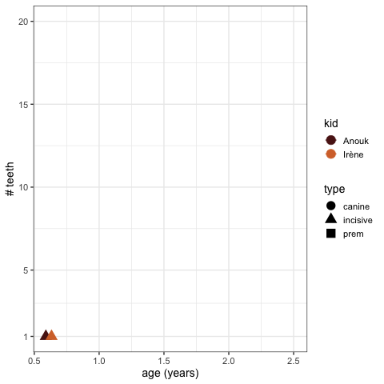

```{r setup, include=FALSE}
knitr::opts_chunk$set(echo = TRUE)
library(dplyr)
```

Teething can be tough for kids, and so for the parents. For our first kid, it was actually pretty painful.
Then, I wanted to see how synchronize the second kid would be with the first one.

## Input data

This was an old input, now I would use the [datapasta](https://github.com/milesmcbain/datapasta) rstudio addin by Miles Mc Bain to get a `tribble` from any spreadsheet.

```{r}
#| eval: true
tibble::tribble(
      ~kid,        ~date,                ~teeth,
   "Anouk", "2014-03-31", "incisive inf cent D",
   "Anouk", "2014-04-18", "incisive inf cent G",
   "Anouk", "2014-07-02", "incisive sup cent D",
   "Anouk", "2014-06-09", "incisive sup cent G",
   "Anouk", "2014-07-03",  "incisive sup lat G",
   "Anouk", "2014-07-26",  "incisive sup lat D",
   "Anouk", "2014-08-12",  "incisive inf lat D",
   "Anouk", "2014-10-12",  "incisive inf lat G",
   "Anouk", "2015-01-04",        "prem 1 sup G",
   "Anouk", "2015-01-11",        "prem 1 sup G",
   "Anouk", "2015-01-11",        "prem 1 inf D",
   "Anouk", "2015-02-01",        "prem 1 inf D",
   "Anouk", "2015-02-01",        "canine sup G",
   "Anouk", "2015-02-12",        "canine sup D",
   "Anouk", "2015-03-28",        "canine inf D",
   "Anouk", "2015-04-04",        "canine inf G", # imputed data
   "Anouk", "2015-10-15",        "prem 2 inf G",
   "Anouk", "2015-10-15",        "prem 2 inf D",
   "Anouk", "2015-12-21",        "prem 2 sup D",
   "Anouk", "2016-03-01",        "prem 2 sup G",
   "Irène", "2017-05-11", "incisive inf cent D",
   "Irène", "2017-05-18", "incisive inf cent G",
   "Irène", "2017-07-11", "incisive sup cent D",
   "Irène", "2017-07-25", "incisive sup cent G",
   "Irène", "2017-08-03", "incisive sup lat D",
   "Irène", "2017-08-04", "incisive inf lat D",
   "Irène", "2017-08-04", "incisive inf lat G",
   "Irène", "2017-08-23", "incisive sup lat G",
   "Irène", "2017-09-30",        "prem 1 inf D",
   "Irène", "2017-09-20",        "prem 1 inf G",
   "Irène", "2017-10-22",        "prem 1 sup D",
   "Irène", "2017-10-20",        "prem 1 sup G",
   "Irène", "2018-04-04",        "canine sup D",
   "Irène", "2018-04-28",        "canine inf D",
   "Irène", "2018-05-15",        "canine sup G",
   "Irène", "2018-05-25",        "prem 2 inf G",
   "Irène", "2018-06-01",        "canine inf G",
   "Irène", "2018-06-07",        "prem 2 inf D",
   "Irène", "2018-09-04",        "prem 2 sup D") -> teeth
```
```{r}
count(teeth, kid)
```


From [Wikipedia: Dental notation](https://en.wikipedia.org/wiki/Dental_notation)

``` cell-output-stdout
Primary Dentition
        upper right - 5             upper left - 6
             55 54 53 52 51 | 61 62 63 64 65 
          R --------------------------------- L
             85 84 83 82 81 | 71 72 73 74 75 
        lower right - 8             lower left - 7

 I - incisor
 C - canine
 P - premolar
 M - molar
```


## Plotting


```{r}
#| eval: false
teeth %>%
  mutate(date = parse_date(date),
         t_teeth = word(teeth, 1),
         age = case_when(kid == "Anouk" ~ date - ymd("20130828"),
                         kid == "Irène" ~ date - ymd("20160922")),
         age2 = as.numeric(age) / 365) -> teeth_tp
teeth_tp %>%
  group_by(kid) %>%
  arrange(age) %>%
  mutate(n_teeth = row_number()) %>% 
  ggplot(aes(x = age2, y = n_teeth, colour = kid), width = 20) +
  geom_line() +
  geom_point(aes(shape = t_teeth)) +
  scale_y_continuous(breaks = c(1, seq(5, 20, 5))) +
  theme_bw(14) +
  labs(x = "age (years)",
       y = "# teeth",
       shape = "type")
```

## Animate

```{r}
#| eval: false
library(gganimate)
teeth_tp %>%
   group_by(kid) %>%
   arrange(age) %>%
   mutate(n_teeth = row_number()) %>% 
   ggplot(aes(x = age2, y = n_teeth, colour = kid)) +
   geom_line() +
   # to try transition_reveal()
   transition_reveal(kid, n_teeth) +
   #ease_aes("linear") +
   shadow_trail() +
   geom_point(aes(shape = t_teeth), size = 5) +
   scale_y_continuous(breaks = c(1, seq(5, 20, 5))) +
   scale_color_manual(values = wesanderson::wes_palette("GrandBudapest1")[3:4]) + 
   theme_bw(14) +
   labs(x = "age (years)",
        y = "# teeth",
        shape = "type") -> tp
animate(tp, nframes = 60)
anim_save("teething.gif", last_animation())
```


