::: {.callout-note}

## Post series

This post belongs to a series about the **Ventoux**:

- [Maintenance 1](index.html) this post
- [Maintenance 2](../2020-07-14_ventoux-2/index.html) on the 2020-07-14
- [Maintenance 3](../2023-04-29_ventoux-3/index.html) on the 2023-04-29

:::

Many people started a project during the lock-downs due to covid-19
pandemic. In Luxembourg, we got only one and it triggered my long due
bike project. I had two goals, 1) learn basic bike mechanics 2) restore
my teenage bike: a Peugeot Ventoux. Learning by doing is, for me, the
best way. Yes there are tons of youtube videos about everything but
without the real thing to do I have no will to just watch them.

# Peugeot Ventoux

The serial number engraved below the bottom bracket is `Y003 30825`.
Meaning it was built in March 1990. I probably got it in March 1991 and
I remembered reading again and again the bike catalog waiting for my
birthday to come.

The only picture of this catalog that seems relevant online is this one
from the Netherlands:

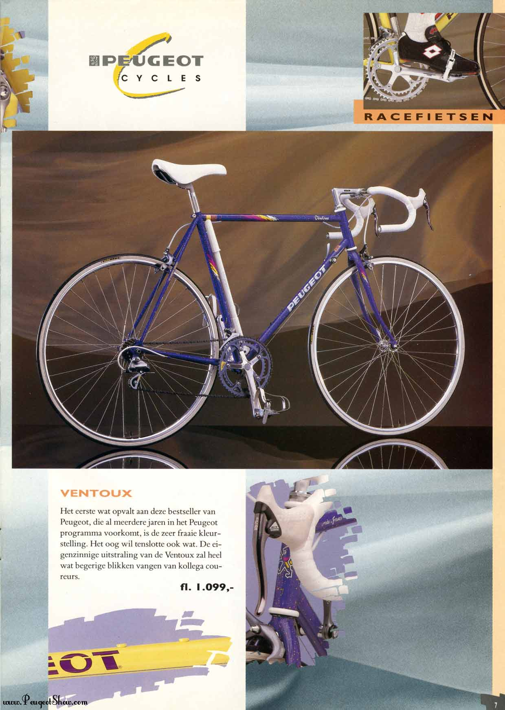

Mine was yellow / grey and I used until 2010 when I left France. And for
10 years it collected dust in some basements.

In 2020 it looked like this:

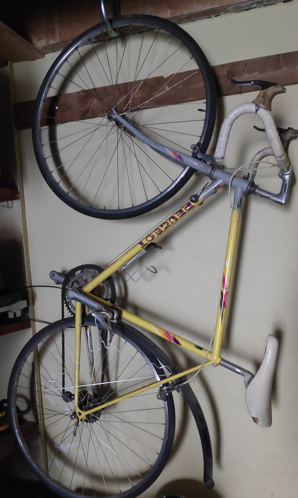{.lightbox height="800px"}

Quite a miserable bike, I decided to give it a try bringing back to some
ride-ready state and if I failed it would not harm much.

## Unmounting the bike

I never unmounted a crank set, a cassette nor even a chain. For 20 years I just put 
air in tubes and changed them when got a puncture. Hardly did a maintenance in bike shops neither.
Thinking about it, that was not smart. I might have changed brake pads and oil chain but it sounded like too much work.
I believed in eternal which didn't go wrong while I though this way but really could have been.

## Ordering new wheels

For the wheels, they looked crooked, worn and spokes fragile. So I decided to buy a new set.
It would solved the freewheel issue. The set costs €100 which sounded just fair.

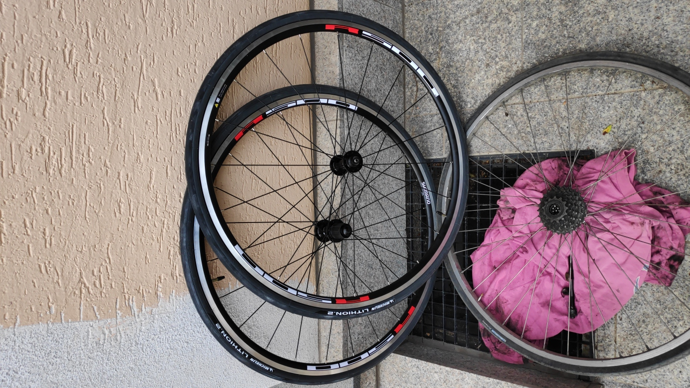{.lightbox height="600px"}

Also add tires and tubes, cheap ones (turned out not great).

## Brakes and tools

Bike tools are cheap and last a lifetime. Should have invested in that way earlier.
Chain whip is easy to use, same for a chain tool. For the crank removal (and bottom bracket),
the main issue is not the price, rather the number of standards.

Here is what I purchased from _Probikeshop_ on the 2020-05-13

| Item                                                    | Quantity | Price (€) |
|---------------------------------------------------------|----------|-----------|
| Two wheels SHIMANO R501 - 10S(56233) Freewheel SHIMANO  | 1        | 102.99    |
| Chain 9S SHIMANO HG53 DEORE / SORA - 116 links          | 1        | 12.49     |
| SHI221668 Shimano BL-R400 Brake Lever - black           | 1        | 28.50     |
| Shimano PARK TOOL FR-1.3(92114) freewheel               | 1        | 10.49     |
| Chain whip BBB TURNTABLE 10S BTL-11(61856)              | 1        | 14.49     |
| Tires MICHELIN LITHION 2 700x25c                        | 1        | 30.98     |
| Air Tube MICHELIN A1 AIRSTOP BUTYL 700x18/25c           | 2        | 7.98      |
| Two calipers SHIMANO SORA 3000                          | 2        | 40.90     |
| Cable brake Kit and hose SHIMANO PTFE                   | 1        | 30.90     |
| Bar tape CLASSIC COMFORT                                | 1        |  7.49     |

I ordered new brake calipers as the current **Shimano** _Exage_^[Quoting Shimano "EXAGE, coined from “excellent,” “exceed” and “age”. Most certainly it exceeding its age!] look wasted (see details in the margin).

:::  {.column-margin}

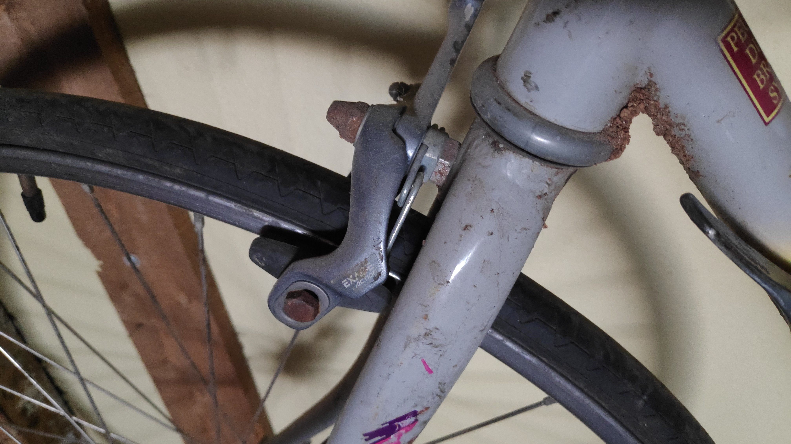

:::

## Mounting the cassette

Instead of buying a new cassette and chain, I only got a new chain and cleaned the cassette.
Was a lot of work and realized too late, it was totally worn out and we soon damage the brand-new 
chain. But, learning is long process.

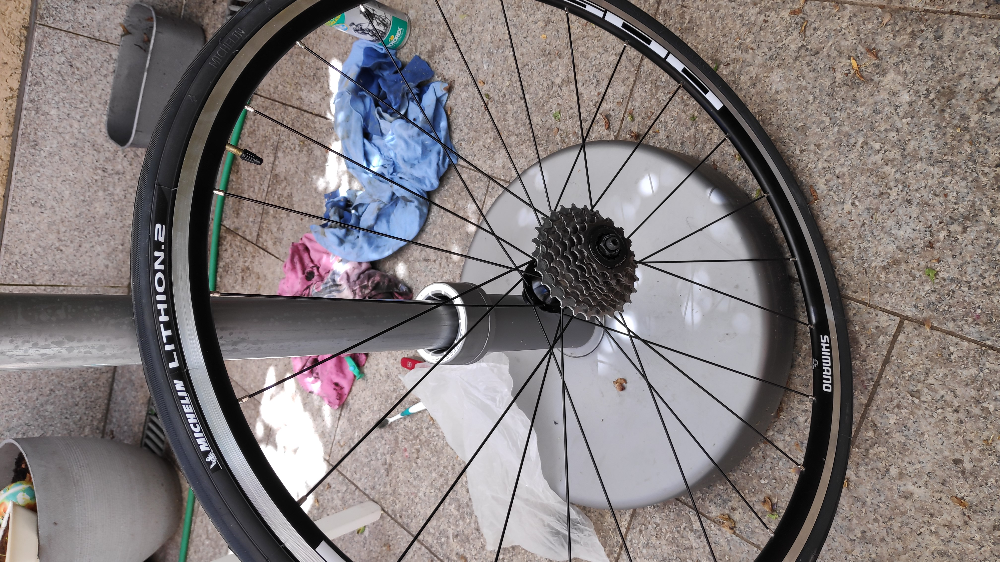{.lightbox height="500px"}

## Cleaning up

After much cleaning, mounting the wheels, removing the brakes and tape bar, looks quite nice 
already with new shiny wheels. The saddle is a _selle royal_ from my old [Von Backhaus, 2012 Copenhagen](../2015-01-25_winter-is-coming).

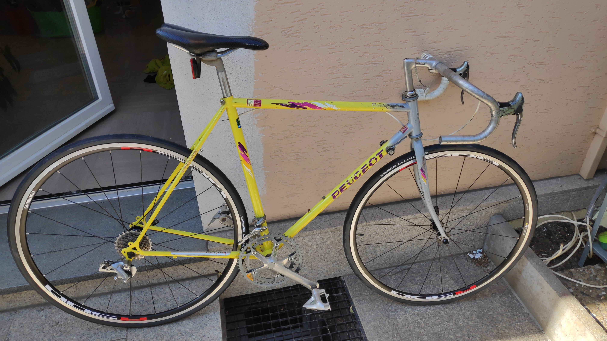{.lightbox height="500px"}

## New chain

Never did this, turned out to be not so complex (I now used a better [chain tool](https://www.parktool.com/en-int/product/chain-tool-ct-3-3)).
I aligned the old and new chain to have the same number of links:

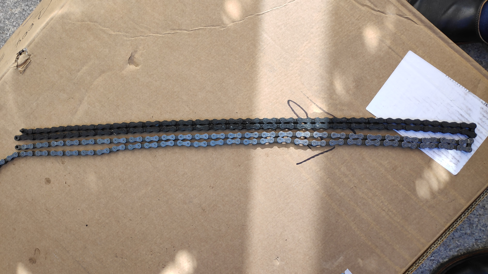{.lightbox height="500px"}

## New brakes and housing cables

Another step I experienced for the first time. New housing and cables for both front and rear brakes along the new brake commands on the handle bar. 
Was easy but took time because I carefully think twice before cutting anything.
I added a bit of oil on the cable before putting them inside hoses.

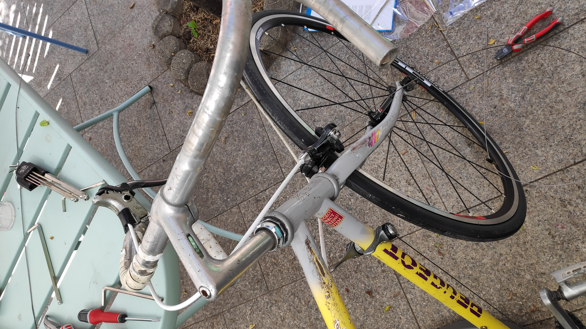{.lightbox height="500px"}

## First ride!

With a transmission and brakes, riding the Ventoux was feasible. Quite emotional to ride it again 
after so long. It was smooth and nice.

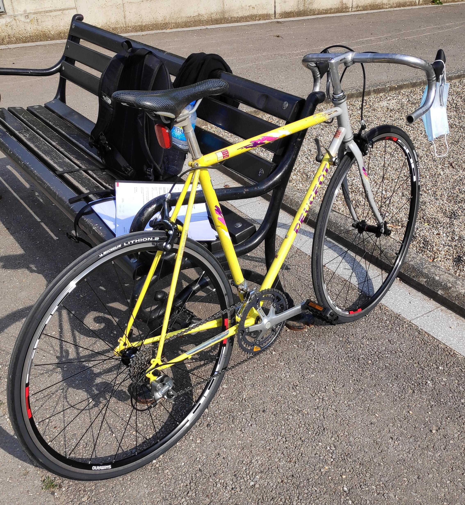{.lightbox height="500px"}

Pedals are from the Diverge bike I got in May 2020 and I unfortunately did not document the setup
 of the derailleur cable. This was quite ok, I kept the existing gear lever on the down tube, not the indexed setting but the free one. The front derailleur got a new lever (we will see that I changed my mind later on), the small chain ring (weird ovoid shape!) was too small and the big one (52T) way too big.
 
## Tape bar and fenders

Finally, a new tape bar (white in homage of the original one) that took me a lot of time to install 
as I wanted to do it correctly (as usual see the great video from [Calvin Jones](https://www.youtube.com/watch?v=5MzIiv7pewE) about this). 

::: { layout-ncol=2}
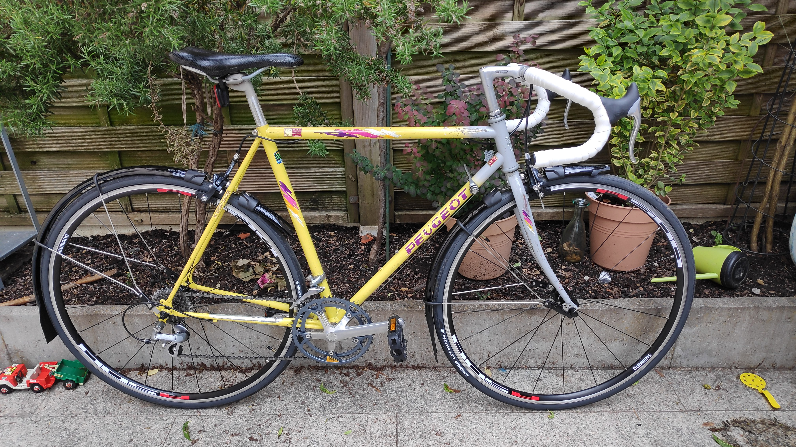{.lightbox}

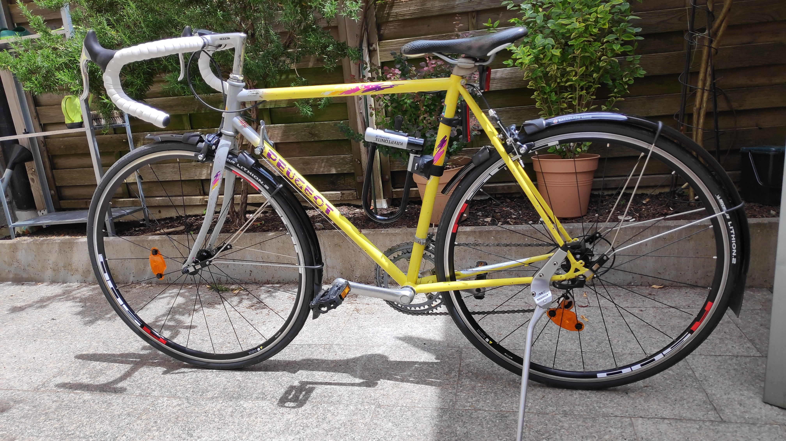{.lightbox}
:::

The fenders are the _SKS_ long blades and still perfectly fine more than 3 years later.

The side kickstand was actually too heavy and honestly quite ugly, it quickly went over to another bike.

Of note, the wheel orange reflectors are still there with a red reflector on the saddle.
Rear lamp a generous gift from my Danish friend Christian and the U-lock holder did not hold more than 2 weeks.

Bike was finished on the 16th of June, so 6 weeks after starting this project.
Much more to come after this first step.

## Acknowledgements

Description image from bike wheels transformed by the fun package
[`paintr`](https://github.com/cj-holmes/paintr) by **CJ Holmes**.
