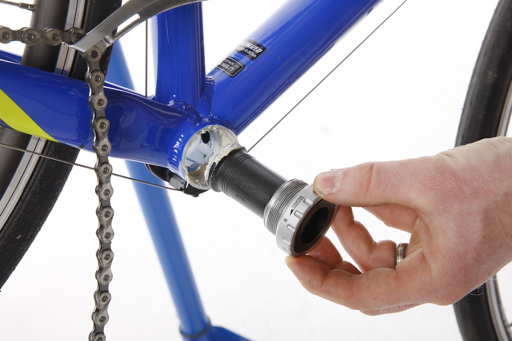
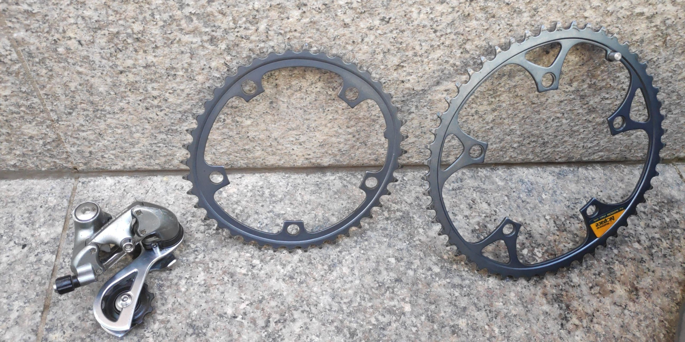
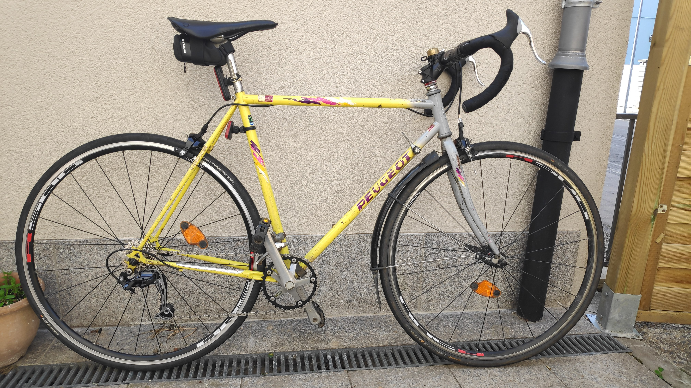
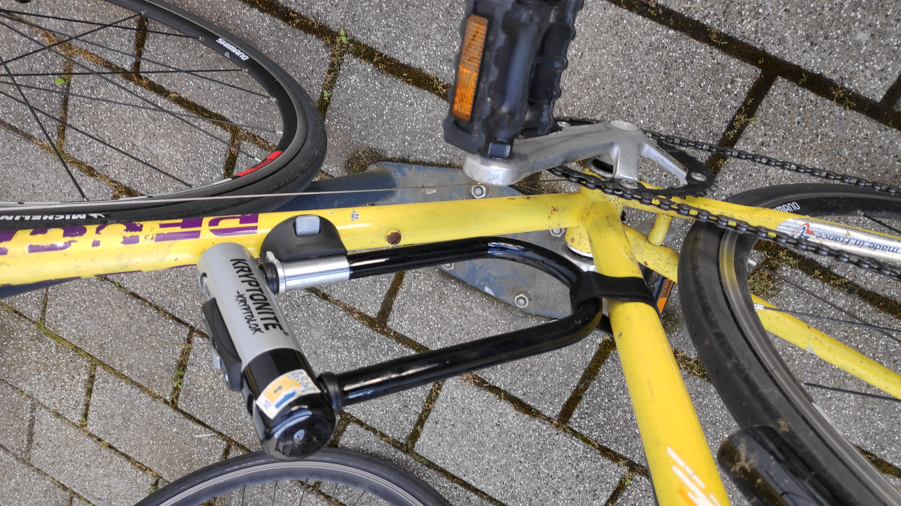
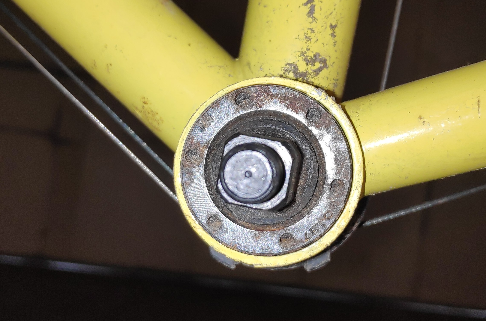
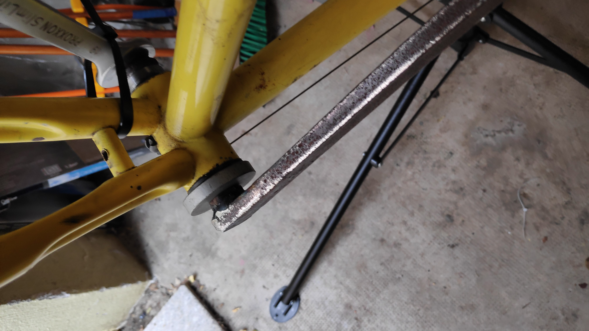
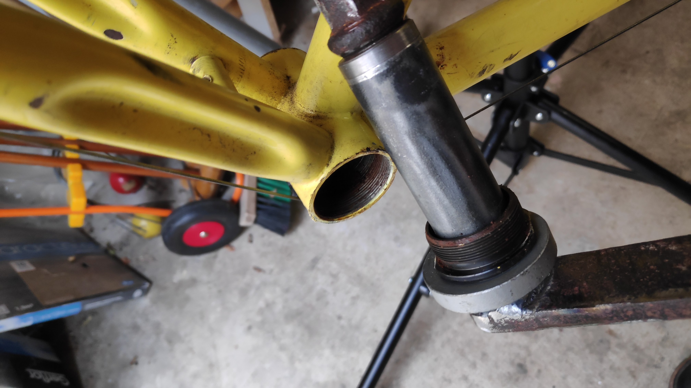
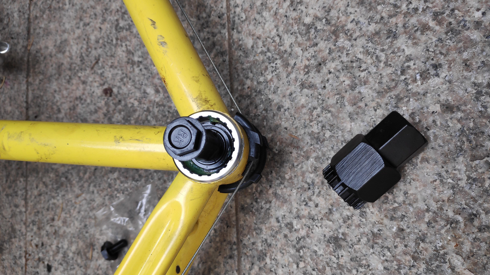

# Issues arising

## The bottom bracket

After riding the bike daily a few months, it started to present some problems.
Most annoying and concerning: the **bottom bracket**. This piece is at the bottom of 
the frame, exposed to water splash and contains the axle attached to the pedals.

{.lightbox heigh=300px}

The role of bottom brackets is to transmit the pedaling force to the chainring: quite important!

It was wobbling and I knew nothing about replacing it, nor just removing it (which turned out to be the critical problem!). It was obvious it was rusty because of its age and the location. Another issue is to find the _right model_. A bottom bracket is less 
than 20 euros but which one is compatible 30 years later with mine?
My trustful Danish friend advised me wisely to look into the [Sheldon Brown](https://www.sheldonbrown.com) 
[bottom bracket database](https://www.sheldonbrown.com/bbsize.html#shimano).

::: aside
 [Sheldon Brown](https://www.sheldonbrown.com)  looks like a wonderful man whose 
 tireless collection of information was so valuable that beyond his death, friends continue to maintain it online. Kudos to him and them.

:::

Dimensions from France, Italy, UK are all reported and I managed to find out that
 the Shimano BB-UN55 should fit (and it did).

 Second Command to bike24.de 2020-07-14.

| Item                                                | Quantity | Price |
|-----------------------------------------------------|----------|-------|
| PTO147795 Park Tool CT-3.2 Chain Tool               | 1        | 34.40 |
| PTO111383 Park Tool BBT-22 Bottom Bracket Remover   | 1        | 19.65 |
| SHI123592 Shimano BB-UN55 Bottom Bracket JIS Square | 1        | 13.75 |

## Chainring and derailleur

So far I had cleaned up the original chainring and derailleur Exage models.

{.lightbox heigh=300px}

But the large chainring with its enormous 52T was too big for a commute bike.
Derailleur was working ok, but I was also curious to install one, even if I had no 
experience. No derailleur hanger to be seen, it was directly screwed in the frame.
Did a try with a Sora basic derailleur purchase.

## Handle bar and tape

Since I need to order those transmission items, I took  the opportunity to also changed the handle bar.
I was already happy with a gravel bike which handle bar was fairly large (compare to road bike). The price was reasonable and it was worth also learning about the stem, headset config, dismantle and remounting all this.

Third command to bike24.de 2020-08-01

Handle part, stem and derailleur Sora

| Item                                                | Quantity | Price |
|-----------------------------------------------------|----------|-------|
| XLC ST-M15 Comp 31.8 Stem Base Angel - Length: 35° - 60 mm | 1   14,74 EUR  |
| XLC ST-L03 Ahead-Adapter for Threaded Forks | 1  | 13,75 EUR    |
| Control Tech One Handlebar Width: 44cm |  1  | 24,57 EUR   | 
| Deda Handlebar Tape Color: Gun Barrel Grey | 1 |  7,86 EUR    |
| Deda Handlebar Tape Color: Night Black | 1  | 7,86 EUR   | 
| FSA Spacer Polycarbonate 1 1/8" (1 pcs) Color: red | 1 |  0,88 EUR  |  
| Shimano CS-HG400-9 Cassette 9-speed Ratio/teeth: 11-32 | 1  | 18,67 EUR   | 
| Shimano Sora Chainring for FC-3503 - 3x9-speed - black  39 teeth | 1 |  11,79 EUR   | 
| Gebhardt Chainring Bolt Niro Length: 5,4 mm | 5 |   14,50 EUR    |
| Shimano Sora RD-R3000-GS Rear Derailleur 3x9 medium | 1 |  22,60 EUR   | 

### Installing a new tranmission

I postponed the bottom bracket replacement as it was really stuck. The handle bar though was easy enough, placing the tape took me a long time because I was carefully all steps of the necessary Calvin Jones youtube videos.
The chainring I wanted only one, it is easier to maintain and it makes not much sense for a commute bike to have more. I chose a number of teeth in between my 2 current ones. I picked arbitraly 39 teeth, was a good pick.
The derailleur, I knew the frame can handle cassettes of 7 speeds. But the lowest I found online was 9! I did a try and thanks to the magic of steel, I could enlarge the frame a bit and it fits.
Derailleur went screwed on the frame as the original one and looked ok. The main issue was the number of links to keep on the 9S chain. I did a bit random, followed Calvin Jones advice but was not so great.

After replacing all this, it looks like this 

{.lightbox heigh=400px}

The derailleur was too much under tension I now observe.

### Note about the front derailleur

Concerning the front derailleur, I removed everything. See here a close-up:

{.lightbox heigh=400px}

However, I had a big crash one day, chain got suddently stuck and I felt badly. I never understood what happened. A Russian friend adviced me to install back the **chain guide** from the front derailleur. So I did and 4 years later this issue never happened again. I keep the front derailleur installed but removed the cable and even the lever.

## Got the bottom bracket out!

Removing the pedals is easy but then it looks like this:

{.lightbox heigh=200px}

See the amount of rust and how little margin there is for a bottom brack removal tool. It never worked, despite using WD40 and forcing a lot. A better tool was needed.

### The homemade BB tool

My step dad was working in a steel foundry. I described the problem and **Sheldon Brown** (yes again this amazing man) adviced a third option to remove rusty BB fro the _inside_. My step dad then welded a long steel bar to a heating tube with a tight bolt. It was amazing and thanks to him, I got it out!

### Setup

Once in place, it looked like this. The non transmission part, I attached a wrench to block it on the frame.

{.lightbox heigh=400px}

Then I followed my step-dad adivce, don't push like mad but hammer it, the shocks will make it. He was right.

The BB cup, moving in motion



### Outcome

Check out this damned piece of rust !

{.lightbox heigh=400px}

The new bottom bracked once in place with the tool to screw it:

{.lightbox heigh=400px}

What a journey, that was a massive amount of work and stress but was worth it!