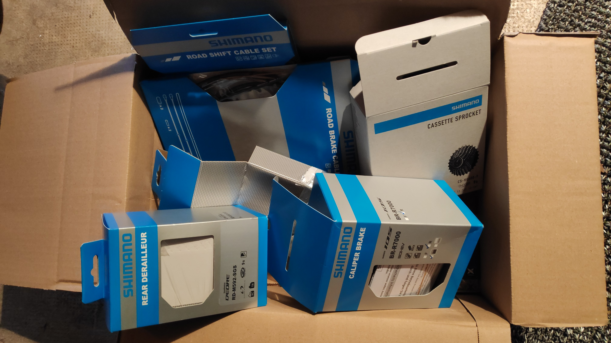
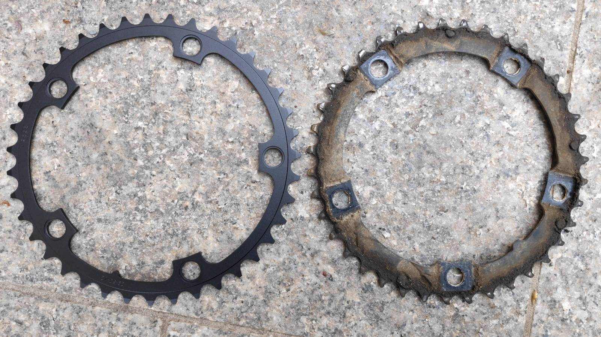
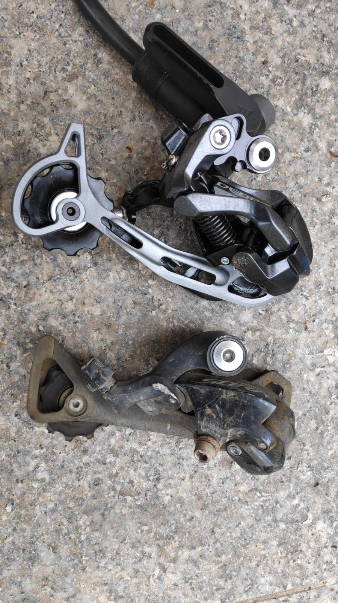
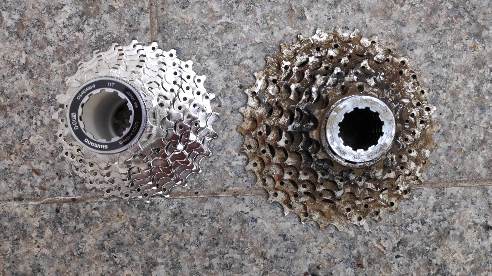

After some years, the bike is really a good commuter and brings much joy.
However, like every machine it needs maintenance. And this offers chances for better spare items.
Especially, the **Sora** series from Shimano is cheap but show some clear weaknesses to cold, salt and water.
They got rusty and not so pleasant to use, so today we need better:

- brakes
- derailleur

Like my famous Danish friend, who I quote frequently, says: 

> Who needs better products than a 105?

I must mention, he actually uses a SRAM derailleur, but let's say he is right, the 105 are very nice products.
I know them from my gravel and several years later they do work nicely.

## Ordering

| Qty | Item No. | Description                                |  Price        |
|----|-----------|--------------------------------------------|---------------|
|1   | SHI371053 | Shimano 105 BR-R7000 Brake Caliper - rear | 38.98 EUR     |
|1   | SSP527134 | Shimano Road Shift Cable Set - Stainless Steel | 9.74 EUR |
|1   | SSP526727 | Shimano Brake Cable Set Road Stainless Steel | 11.69 EUR  |
|1   | SRA131571 | SRAM PowerGlide Chainring 130mm - 39 teeth | 16.56 EUR    |
|1   | SHI196481 | Shimano CS-HG400-9 Cassette 9-speed, Ratio/teeth: 11-25 | 24.36 EUR |
|1   | KMC107578 | KMC X9 Chain - 9-speed - silver/grey | 14.61 EUR   |
|1   | SHI111662 | Shimano Deore RD-M592-SGS Shadow Rear | 38.98 EUR  |

: bike24.de Order March 2023 {.striped .hover}

# Replacements and upgrades

## Receiving parcel

{height=300}

## Transmission

Let's change everything in the transmission to start on fresh good basis.

### Chainring

Since SRAM and Shimano are compatible, I give a try to SRAM for the chainring. Looks light and neat.

{height=300}

### Rear derailleur

Derailleur, I didn't know what to get, I went for the _Deore_ as I did 8,000 km with it on another 
bike and it stills work perfectly. The length of the derailleur, I picked a bit at random.
Worth noting I am using a bottom-tube lever without indexing so I can pick a MTB derailleur without problem.
Switching gear is done with some _feeling_, without precise intervals.

{height=300}

### Cassette and chain

Chain was a KMC, recommended by the usual Danish friend[^1].

{height=300}

## Rear Brake

The front brake will come later, installing the 105 was almost identical as the Sora, except the obvious 
quality differences as seen on the picture. Manipulating the spring and its tension also shows how cheap the Sora is.

{height=300}

### Tires

Listening to some advice online, I tried the **Continental 4 seasons**. Very disappointing product that last actually 8 seasons. 
Expensive, I got multiple punctures,
not great stuff. Pros were:

- Easy to un/mount (luckily with the numerous punctures)
- Safe under rain condition

Now using **GP5000** and the first winter proved them to be safe, efficient and I got **zero** puncture.

## Final result (for now)

{height=300}

[^1]. Of note, the KMC chain did a great job. Lasted one year but a rough winter season. Got worn up to 60%.
