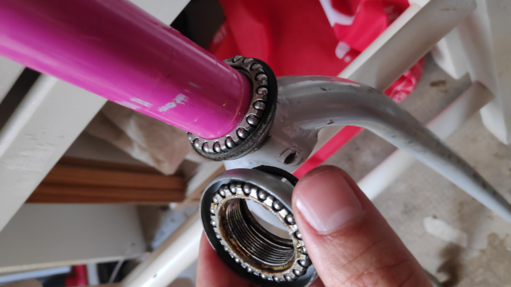
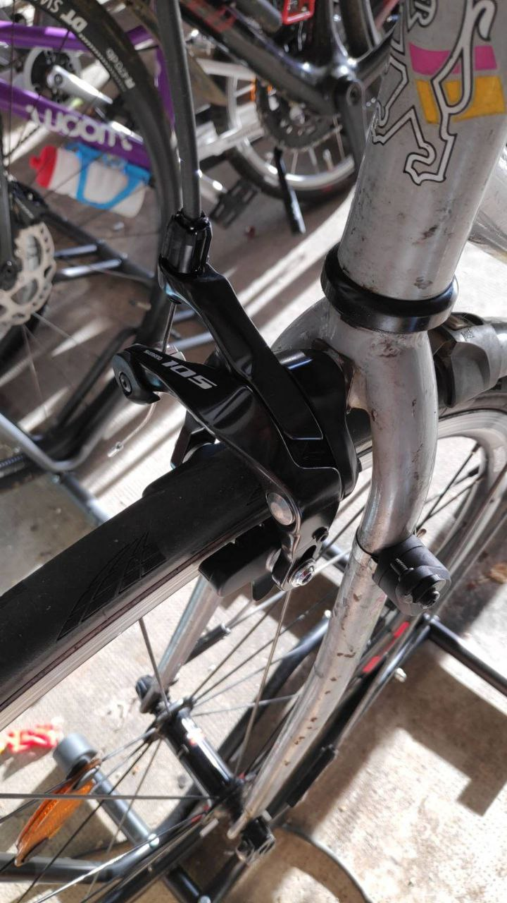

::: {.callout-note}

## Post series

This post belongs to a series about the **Ventoux**:

- [Maintenance 1](../2020-04-27_ventoux-1/index.html) on the 2020-04-27
- [Maintenance 2](../2020-07-14_ventoux-2/index.html) on the 2020-07-14
- [Maintenance 3](../2023-04-29_ventoux-3/index.html) on the 2023-04-29
- [Maintenance 4](index.html) this post

:::

## Headset

In 2020, the headset was serviced minimally and without much knowledge by me.
After unmounting the headset, I cleaned all little balls (lost one!) and mounted back 
with new grease. 

{height=300}

In 2023, the up cup made of plastic started to display a crack that became bigger and bigger.
I decided to have done by a professional who changed the full headset, for 19 euros material and 30 for man hour.
Feels much more solid, all metallic cups and new steering feeling.

{height=300}

## Front 105 caliper

Since the rear 105 brought satisfaction, I invested for its complement for the front brake.
Bye bye Sora, you served me well.
