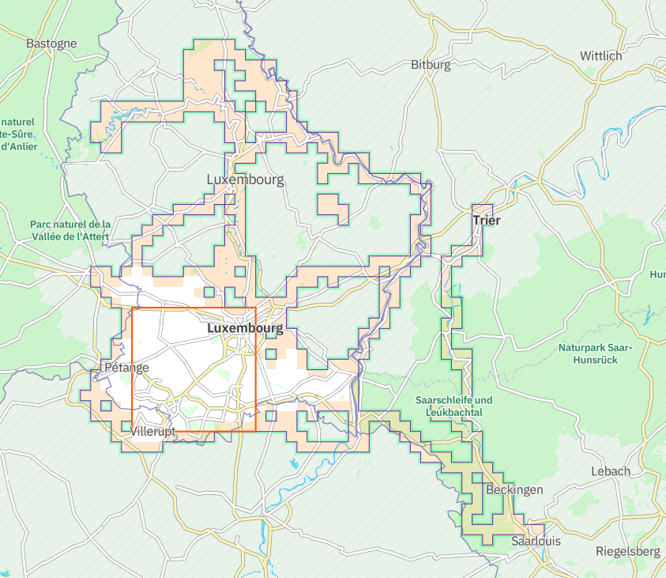

## Wandrer Earth

[Wandrer Earth](https://wandrer.earth/) is a website that fetch your activities (either on bike or on foot) and compare the GPS tracks with your previous ones.

It retains the **new ridden** kilometers, and a scoring system does some ranking.
I am not so much into this chart but it strongly pushes you to explore 

- New paths
- Plan in advance to ride new streets in towns / villages
- Be exhaustive for some neighborhood / towns and why not countries!^[Two friends of mine have ridden > 50% of _all_ bikeable trails / roads of Luxembourg. Pretty impressive]

In _red_ the parts that I already ridden, in _blue_ the new ones.

I absolutely love this game and sometimes go around some blocks just to collect new streets. Of note, I export the [Garmin](https://www.garmin.com) map and add it as a layer to my GPS. Since I ride mostly with the map on, I can see _red_ tracks displayed and can take opportunity to change my route to fetch some new meters.

### Chrome extension

For planning tours, I am using [komoot](https://komoot.com). 
It is not part of the   games but fantastic for the task. 
[Craig Durkin](https://www.highcube.org/), the man behind **Wandrer Earth** has developed an extension that allows to display the ridden or unridden tracks in **Komoot**. 

### Dependency to Strava

One cons that some finds is that it works only with [strava](https://strava.com). 
Actually all 3 websites presented here are fetching data from **Strava**.

## Squadrats

[Squadrats](https://squadrats.com/) is using your GPS tracks to create, as you guessed, squares. Squares of different sizes and there are different ranking, like extending the bigger one (_ÜBERSQUADRAT_), having a maximum of squares, or little ones (_Squadratinhos_).

This pushes you to go farther from home, hitting just a corner of a squadrat and it's yours. I only recently started to be interested by this game.

## Alternative: VeloViewer

[VeloViewer](https://veloviewer.com/) offers a LOT of graphs. Actually too much for me.
Tried for one year and did not renew my subscription.

