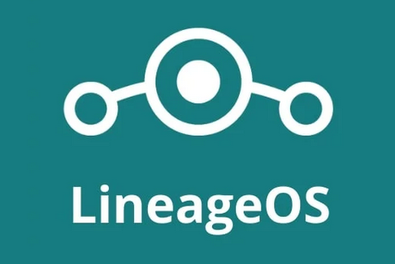
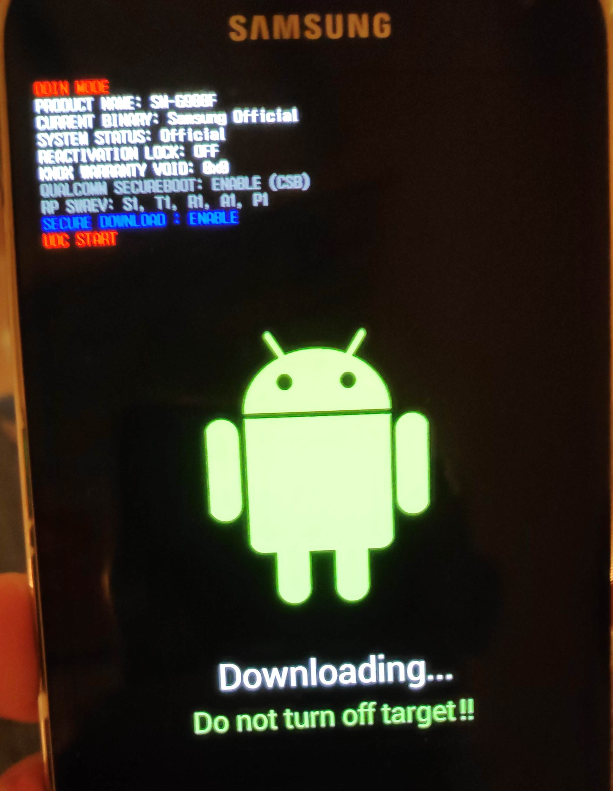
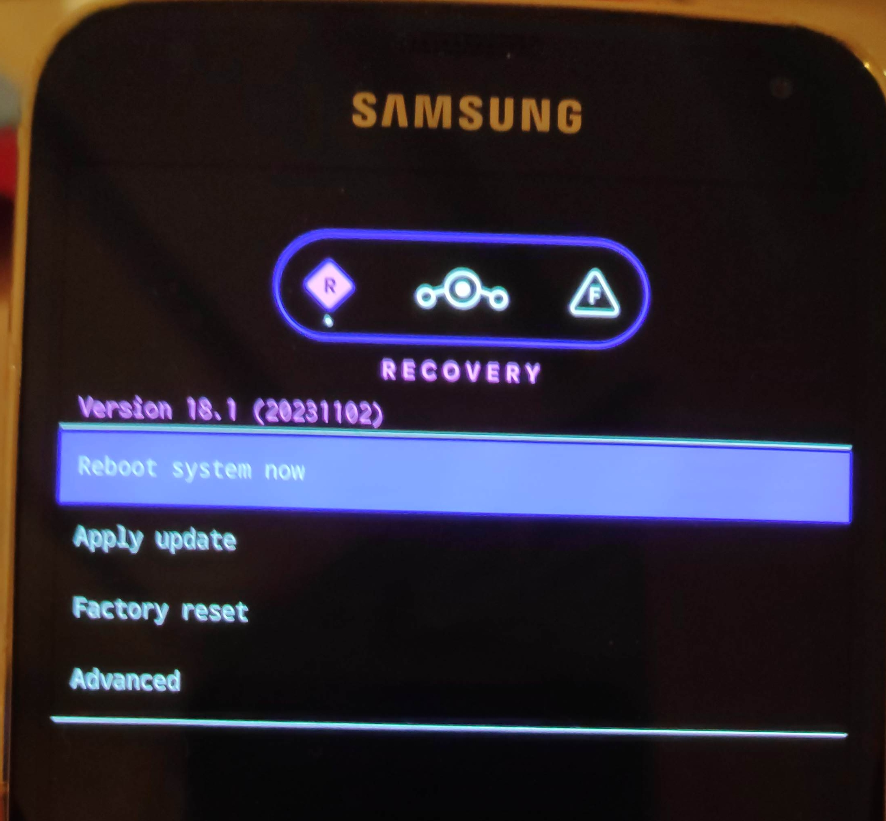
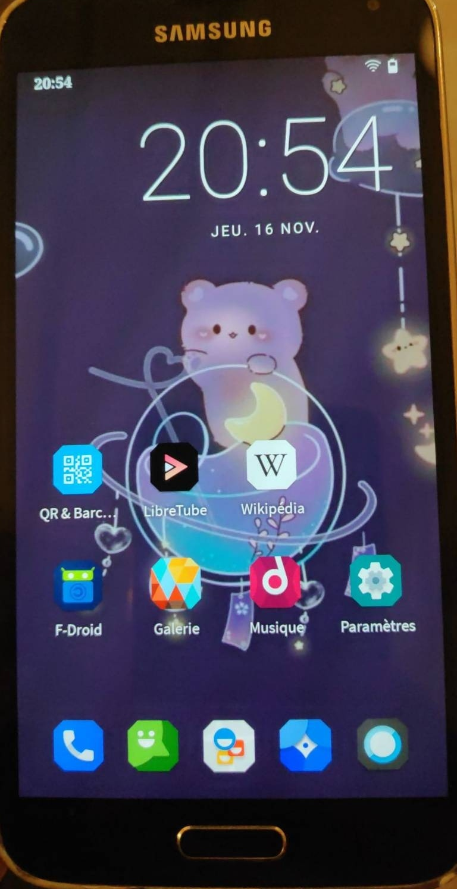

Bought a Samsung S5  in October 2014. It'd served me well for 4 years and since 
was lying in a drawer. Now the next and current smartphone is 5 years old and show some issues. 
Nothing dramatic but one is annoying, it is **not** receiving updates, especially _security_ ones for 3 years now. I don't have much knowledge about the consequences but clearly it is not great.
Thus, here are four motivations for installing an open-source OS on a phone:

- Test the feasibility of having a non proprietary Android (apps outside )
- Get updated Android  
- Get away from 
- Learn new stuffs as I have never done anything with Android OS

## Current Android and state

The phone was as expected at 0% battery. Stayed turn off for 5 years. After charging it for a few moments it booted nicely, everything seems to work. Android version was **6.01**

## LineageOS

I know nothing about alternative Android OS. I show someone on Mastodon installing [**LineageOS**](https://lineageos.org/) so 
I went for this one.

::: {.column-margin}



:::

Luckily, the S5 is a supported devices and I am supposed to install [**klte** Lineage version 18.1](https://wiki.lineageos.org/devices/klte/install).
I followed the steps and of course it went wrong, I assumed the **Odin** step was optional. It is not.

## Workflow

The **recovery** mode is protected. If we reboot in this mode, it is to recover the Samsung Android OS. Did not understand that the **Odin** step was about **erasing** this by the Lineage recovery image. That explained the different images available for **klte**.

1. Setup the laptop with the necessary tools:
    - `adb` android development 
    - `odin`, the  worked nicely, not true we need the  official software
2. Reboot the phone in download mode
3. Install the lineage recovery image
4. **Reboot quicky** in **recovery** mode (otherwise Samsung erases step 3., happened twice....)
5. Sideload the lineage OS (previously converted from `.img` -> `.tar`)
6. Reboot, LneageOs get installed.

I tried the install of  with MindTheGaps but it failed and turned out 
it is available anyway. Well I don't know what happened here.

Let's see in details the different steps

## Mandatory software

The instructions are available [here](https://wiki.lineageos.org/adb_fastboot_guide).

On **Arch**  what was needed:

``` bash
yay odin4-cli android-sdk-platform-tools
```

::: {.callout-note}
Of note, `android-sdk-platform-tools` provides both `adb` and `fastboot` but there are 
located in `/opt/android-sdk/platform-tools/`. I created symbolic links for both tools in 
`~/bin/`
:::

Then I followed the instructions for setting `adb`

To use adb with your device, you’ll need to enable developer options and USB debugging:

1. Open Settings, and select “About”.
2. Tap on “Build number” seven times.
3. Go back, and select “Developer options”.
4. Scroll down, and check the “Android debugging” or “USB debugging” entry under “Debugging”.
5. Plug your device into your computer.
6. On the computer, open up a terminal/command prompt and type `adb devices`.
7. A dialog should show on your device, asking you to allow usb debugging. Check “always allow”, and choose OK

I did not remember doing the step 7. Worked anyway.

## Download images


Following instructions, images are [there](https://download.lineageos.org/devices/klte/builds).

I downloaded 

- `lineage-18.1-20231102-nightly-klte-signed.zip`
- `recovery.img`

and check their sha256sums.

The recovery image is the first one needed, but the `tar` version. To convert `img` to `tar`:

``` bash
tar --format=ustar -cvf recovery.tar recovery.img
```

## Install the custom recovery mode

Plug in the phone in your laptop and be sure that `adb devices` returns a number. Otherwise, it means 
that the USB debugging is not enabled on the phone.

::: {.callout-important}
## Mandatory step!
I first missed this part. The factory recovery mode will **not** allow you to install anything. 
You **must** complete this step AND prevent the rebooting that re-install the factory one. 
:::

This implied rebooting in **download** mode, can be done with either Volume down + Home + Power or

``` bash
adb reboot download
```

Then once ready, to install the custom recovery from Lineage


::: {.callout-important}
## Root permissions
`odin4` must be executed as root, took me too much yime to figure this out.
:::


``` bash
sudo odin4 -a recovery.tar
```

The screen looks like this:

{height=300}

When it is done, I removed the battery, unplugged the phone to be sure it does not erase this custom recovery.

Now boot into this custom recovery mode. With the device powered off, hold Volume Up + Home + Power. 
When the blue text appears, release the buttons.

It must look like this, with the Lineage OS logo:

{height=300}

## Upload the Lineage OS image

On your laptop, upload _aka_ sideload the image, go to `Apply Update`

and on the laptop type:

``` bash
adb sideload lineage-18.1-20231102-nightly-klte-signed.zip
```

Once done, navigate on the phone to `Reboot system now` and the new OS is being installed after the reboot, it should 
last less than 15 minutes (took not even 5 for me).

## Screenshot

After installing F-droid and some apps, everything works great and the phone is still very responsive!
Android version went from 6.01 to **11.0**.

{height=450}

## Edit 2024-02-03: The _Screen Curtain_ drama

My daughter is using this S5 happily for 2 months now. 
No email account, no google apps but F-droid is great.
Then today, she played with many options as usual when in the screen accessibility,
she activated the _screen curtain_. Meant for blind people to preserve their privacy,
the whole screen turns totally black once you enter your PIN.
Going on the Internet, the best thread was on [reddit](https://www.reddit.com/r/LineageOS/comments/sql4s8/screen_curtain_on_samsung_s5_running_181_20210919/). 
I tried the [`scrcpy`](https://github.com/Genymobile/scrcpy/) (which is a great software!), the `adb shell` but all those solutions involved the USB debugging on that was not anymore the case.
The only bit that work was [`scrcpy --otg`](https://github.com/Genymobile/scrcpy/blob/master/doc/hid-otg.md) but I 
did not get what was needed to navigate, or to send relevant characters.
So in end, I rebooted in the recovery mode (Vol Up + Home + Power).
`adb shell` worked, I was able to enable it but, even mounting in `/mnt/system` the `data/` folder was empty.
Thus, I wiped out the partition and _sideloaded_ **LineageOS** again:

`lineage-18.1-20240201-nightly-klte-signed.zip`

And we are able to use the phone again. All custom / app / pictures gone but she 
will remember this lesson apparently.
