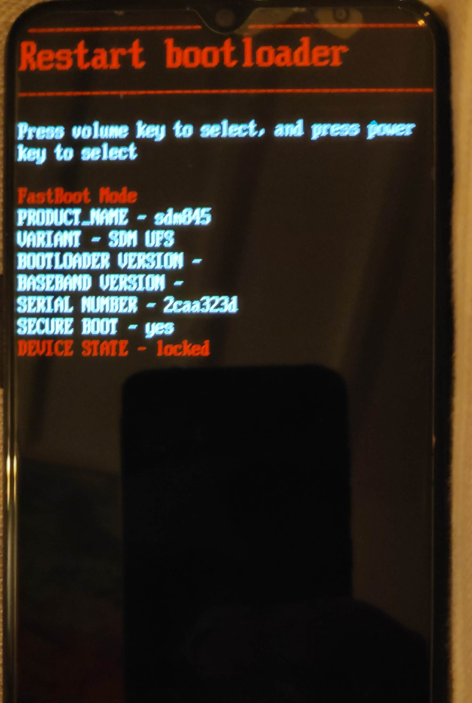
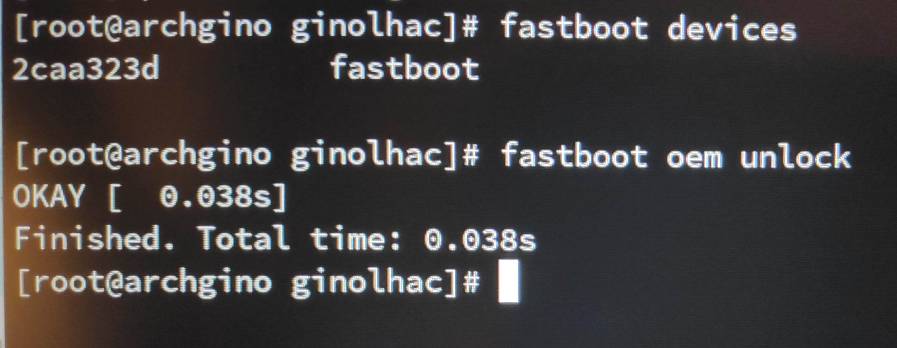
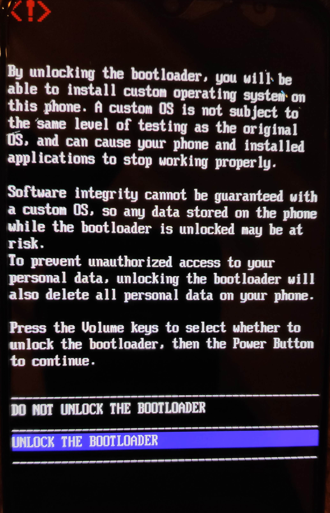
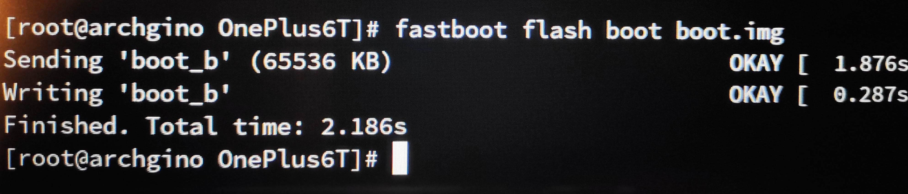
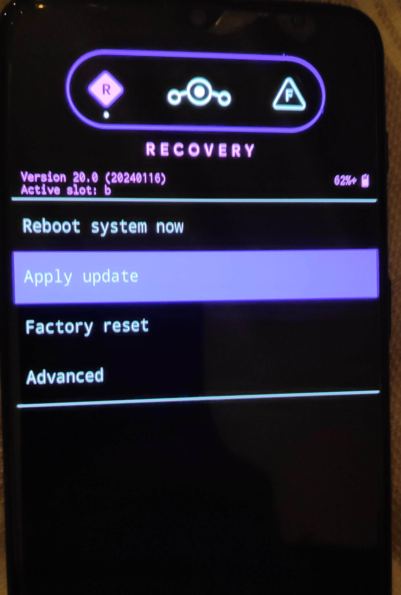
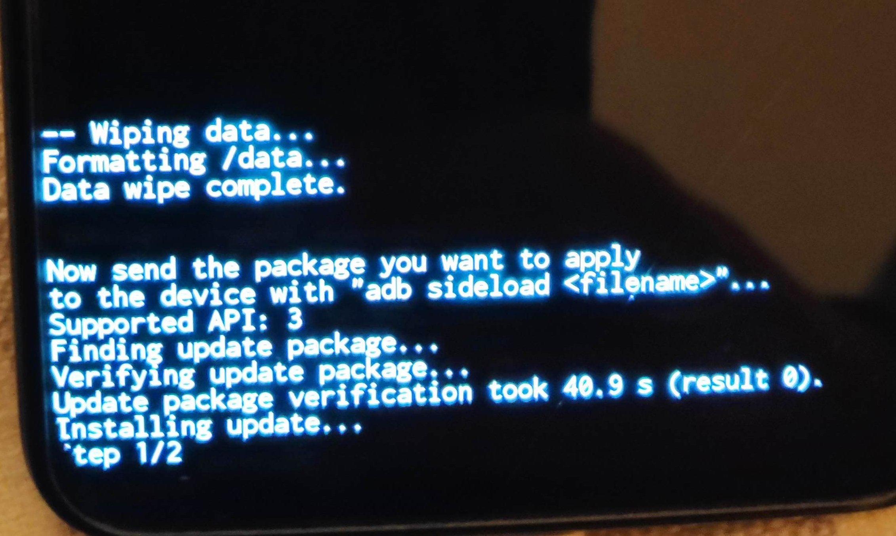
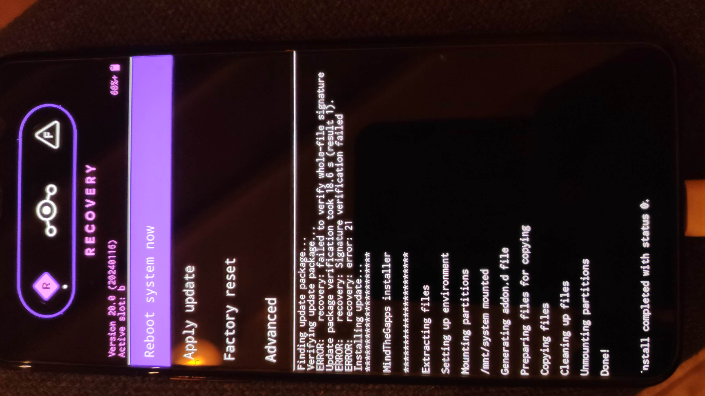
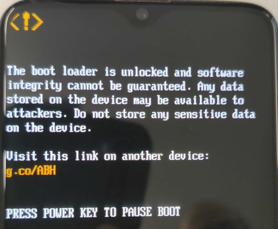

Following the previous attempt (successful) of installing the **LineageOS** [described here](../2023-11-16_lineagesos-s5/), I decided to really change my previous phone from 2018 which last security update was 2020-06-01. The hardware was still working, but the lack of updates was really annoying, stuck with Android 10 and all security holes.

## Candidate phone

My sister had a One Plus 6T in a drawer collecting dust. She wiped it and gave it to me, nice!


## LineageOS on the One Plus 6T

**LineageOS** supports so many (and old) [devices](https://wiki.lineageos.org/devices/) it's amazing. The One Plus 6T corresponds to the [fajita](https://wiki.lineageos.org/devices/fajita/) release and builds are [here](https://download.lineageos.org/devices/fajita/builds).

### Installation

The 8-steps instructions are clearly described in the [wiki](https://wiki.lineageos.org/devices/fajita/install/).

Using the OxygenOS from OnePlus, I had to update from Android 10 to 11 as asked. 

After activating the USB debugging, I had to add my login to the `plugdev` group while 
it was not necessary for the Samsung S5.

``` bash
usermod -aG plugdev login
```

Had to restart the laptop, check you are part of this group with `id`.

::: {.callout-note}
## Of note
All commands are run as `root`.
:::

### Unlock OEM

After rebooting in proprietary recovery: 

{.lightbox height=300}

The following commands:

``` bash
fastboot devices
fastboot oem unlock
```

are super fast:

{height=150}

Result:

{.lightbox height=300}

### Install lineage recovery

``` bash
fastboot flash boot.img
```



Check that after rebooting in recovery mode that you have the **LineageOS** recovery: 

{.lightbox height=300}

Then select **Apply update** on the phone using volume Up/Down and Power to confirm.
On the laptop, _sideload_ the main lineage image, 2 accessories and [MindtheGapps](https://github.com/MindTheGapps/13.0.0-arm64/releases/tag/MindTheGapps-13.0.0-arm64-20231025_200931) if you want to keep Google Play.

::: {.callout-important}
## Watch out

To use the right architecture and Android version (`13` here).
:::

I am not sure what the `dtbo` and `vbmeta` images actually are but I did follow all steps.

{.lightbox height=300}

``` bash

adb -d sideload lineage-20.0-20240116-nightly-fajita-signed.zip 
adb -d sideload dtbo.img 
adb -d sideload vbmeta.img 
adb -d sideload MindTheGapps-13.0.0-arm64-20231025_200931.zip
```

{.lightbox height=300}

and reboot system.


## Aftermath

We started from Android 11, now we have 13. And we continue receiving updates (already one a week after this installation).
Everything is working. The only annoying part is the Fingerprint reader which success reading rate is around 50%. Don't know what is wrong, the sensor or the software treating information.

The bank apps are working, Luxtrust and so on as one friend was telling me that un-rooted ROM prevents usage of these apps.

While installing messaging apps, it was interesting to see the different levels of 
security for restoring/transferring accounts.

- **Signal**
  It is not allowed to have the app working on both phones using the same phone number.
  It makes sense, even if I have only Wifi on the old phone, it could be used to send messages but not with Signal.
  A procedure is proposed to transfer the content (contacts / messages / groups) from the old -> new phone using Bluetooth.
  It worked perfectly. Of note, all linked Signal Desktop were un-linked and I had to re-link them using the new phone.
- **Telegram**
  Very little security. On the new phone, installed the app, received a confirmation by SMS and that's it.
  All chats were restored, and the old phone can still be used along with the Desktop apps.
- [**Simplex Chat**](https://simplex.chat/)
  This messaging app is nice as it does not require any account. Transferring data was feasible, I had to archive an archive with a passphrase,
  copy over this file and restore the database after unlocking it with the passphrase.

Each boot is showing this warning, I gladly ignore.

{.lightbox height=300}

## What's next?

Getting rid of Google Play. Or Google account altogether.
Next goal is to try [CalyxOS](https://calyxos.org/) and the **Aurora store**.
I have restored some security with **LineageOS** but no privacy since I kept Google Play.
