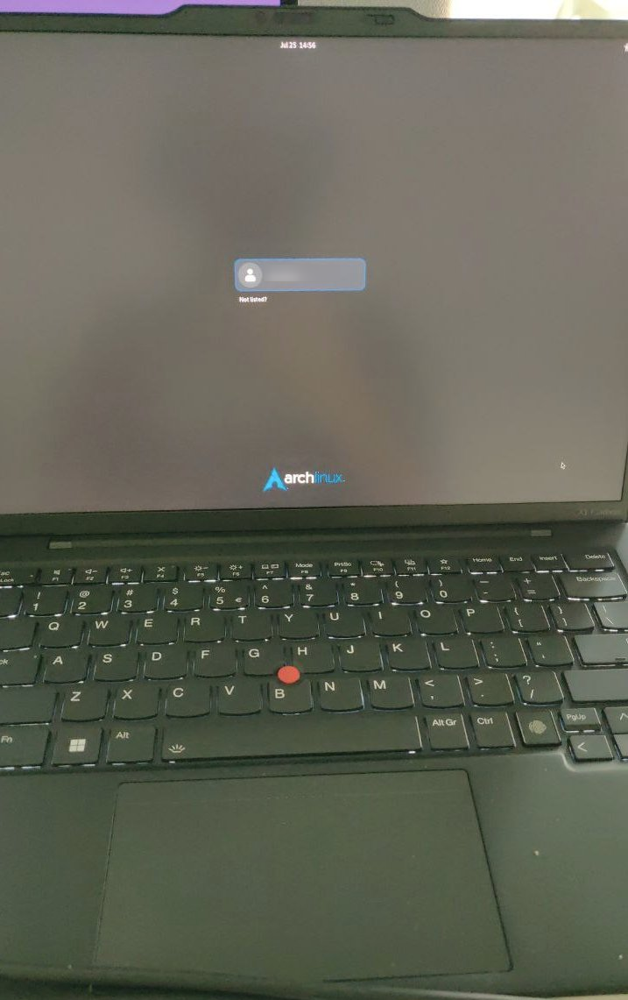

# New laptop: Lenovo Carbon X1 Gen12

I had a Dell XPS13 for the last 5 years. It is a great laptop despite a sightly too small 
screen for my eyesight now. Also, the arrow keys mixed with the Page Up/Down was annoying, too 
close, too small. 

During one teaching class, one student had a **Lenovo Carbon X1** and while helping I used the keyboard 
and liked it a lot. The not shiny screen looked good and 14 inches is an ideal compromise.
Turns out it is also quite compact and weight less than the XPS13!

I ordered high specs and with Ubuntu to be sure components worked nicely. Especially some webcam model is not supported [as reported before](https://wiki.archlinux.org/title/Talk:Lenovo_ThinkPad_X1_Carbon_(Gen_12). The screen is LED 1920x1200 which is just fine for work.


## Install Arch Linux

This is third laptop I am installing **Arch linux** on. A [previous post](../2024-07-29_x1-archlinux/) was published.

### Fetch and check ISO

``` bash
curl -O https://mirror.alwyzon.net/archlinux/iso/2024.07.01/archlinux-2024.07.01-x86_64.iso
curl -O https://mirror.alwyzon.net/archlinux/iso/2024.07.01/archlinux-2024.07.01-x86_64.iso.sig
# check signature
gpg --keyserver-options auto-key-retrieve --verify  archlinux-2024.07.01-x86_64.iso.sig
```

Works:

```
gpg: assuming signed data in 'archlinux-2024.07.01-x86_64.iso'
gpg: Signature made Mon 01 Jul 2024 08:11:25 PM CEST
gpg:                using EDDSA key 3E80CA1A8B89F69CBA57D98A76A5EF9054449A5C
gpg:                issuer "pierre@archlinux.org"
gpg: Good signature from "Pierre Schmitz <pierre@archlinux.org>" [unknown]
gpg: WARNING: The key's User ID is not certified with a trusted signature!
gpg:          There is no indication that the signature belongs to the owner.
Primary key fingerprint: 3E80 CA1A 8B89 F69C BA57  D98A 76A5 EF90 5444 9A5C
```


Right-click in **GNOME Files** on the ISO and open it with `Disk Image Writer` and start restoring on the
32GB USB stick.


### Install Arch from stick

- Disable **Secure Boot** in BIOS
- Boot on stick.

Once in the terminal prompt is `root@archiso`:

- increase font size `setfont ter-132b`


### Connect to Internet

In uni, Ethernet cable is not sufficient since requires 802.1X identity and certificate. 
Used instead WIFI with the `wlan0` interface and the utils `iwdctl` (phone shared connection).


### Format disk and encrypt it

Followed the great guide from [mjnaderi on Gist GH](https://gist.github.com/mjnaderi/28264ce68f87f52f2cabb823a503e673) with some modifications.

Check the `efi` folder listed correctly and that `64` in firmware.

Disk partitions:

``` bash
fdisk /dev/nvme0n1
[...]
```

Results after partioning. 

```
Command (m for help): p

Disk /dev/nvme0n1: 1.86 IiB, 2048209543168 bytes, 4000797360 sectors
Disk model: KXG8AZNV2T04 LA KIOXIA
Units: sectors of 1 * 512 = 512 bytes
Sector size (logical/physical): 512 bytes / 512 bytes
I/O size (minimum/optimal): 512 bytes / 512 bytes
Disklabel type: gpt
Disk identifier: xxxxx

Device           Start         End     Sectors   Size Type
/dev/nvme0n1p1    2048      206847      204800   100M EFI System
/dev/nvme0n1p2  206848     2303999     2097152     1G Linux filesystem
/dev/nvme0n1p3 2304000  3000796671 39998492672   1.9T Linux filesystem
```

Like `mjnaderi`, no swap, we will set `zwap` later.


- Format `/dev/nvme0n1p1` as FAT32
- Format `/dev/nvme0n1p2` as ext4

Then use `cryptsetup` for the main partition:

``` bash
cryptsetup --use-random luksFormat /dev/nvme0n1p3
cryptsetup luksOpen /dev/nvme0n1p3 cryptlvm
```

#### Create LVM volume group

``` bash
pvcreate /dev/mapper/cryptlvm
vgcreate vg0 /dev/mapper/cryptlvm
```

#### Create LVM partitions

Previous install shows hat the root partition was a little small, so increase compare to `mjnaderi`.

``` bash
lvcreate --size 300G vg0 --name root 
lvcreate -l +100%FREE vg0 --name home
lvreduce --size -256M vg0/home
```

then create `ext4` file systems on `root` and `home`.

``` bash
mkfs.ext4 /dev/vg0/root
mkfs.ext4 /dev/vg0/home
```

### Mount new filesystems

``` bash
mount /dev/vg0/root /mnt
mount --mkdir /dev/nvme0n1p1 /mnt/efi
mount --mkdir /dev/nvme0n1p2 /mnt/boot
mount --mkdir /dev/vg0/home /mnt/home
```


### Install the base system

Plus some extras. For Intel CPUs the last one (for the module `microcode`)

``` bash
pacstrap -K /mnt base linux linux-lts linux-firmware openssh less git vim sudo intel-ucode
```

### Generate `fstab`

``` bash
genfstab -U /mnt >> /mnt/etc/fstab
```


### Enter the new system

``` bash
arch-chroot /mnt /bin/bash
```


### Recreate the initramfs image:

``` bash
mkinitcpio -P
```

### Setup GRUB

``` bash
pacman -S grub efibootmgr
grub-install --target=x86_64-efi --efi-directory=/efi --bootloader-id=GRUB
```
 
In `/etc/default/grub` edit 

`GRUB_CMDLINE_LINUX="cryptdevice=/dev/nvme0n1p3:cryptlvm root=/dev/vg0/root"`

and uncomment `GRUB_ENABLE_CRYTODISK=y`

Now generate the main GRUB configuration file:

``` bash 
grub-mkconfig -o /boot/grub/grub.cfg
```


In case of problem, the manual command to open the encrypted partition

``` bash
cryptsetup luksOpen /dev/nvme0n1p3 cryptlvm
```

::: {.callout-important}
## In case of stuck at `"Loading ramdisk"`

Disable Memory protection in the BIOS
:::

## Reboot to your session (text)

After decryption you can log in as yourself.

Install GNOME and enable `gdm`:

``` bash
sudo pacman -S gnome gdm
```

And enable **gdm** service:

``` bash
sudo systemctl enable gdm
```

## Reboot to GNOME

Should see the gdm login

{height=450}


### Activate zwap

instead of a swap partition. Using the AUR package `zswapd` and settings in `etc/default/zramd`

that `max size = 8192MB` (uncomment line)

- Enable service `sudo systemctl enable zramd`

## Post install

- Connect to the wired network

follow SIU [guidelines](https://service.uni.lu/sp?id=kb_article_view&table=kb_knowledge&sys_kb_id=6b30b044939e31101adb72718bba10b0)

- Installation `evolution-ews` and backup from previous laptop / restore to get all settings imported

- Install `gnome-tweaks` and disable CAPS LOCK key

- Install `extension-manager` to have gnome **Appindicator and KStatusNotiferItem Support**
  increase icon size to 24

- Settings > Keyboard 
    - Add English Intl. with AltGr dead keys (not needed eventually)
    - Alternate Character Keys -> Right Super
    - Compose Key -> Right Alt
    
    then right Alt + single quote, than e gives é

- Also generate the locale `en_US ISO-8859-1`

- For the sound to work, install ALSA with `yay sof-firware` and reboot

- Install `yay bluez-utils` and enable service `sudo systemctl enable bluetooth`

- Install from Github the `starship` prompt and `yay fd`: alternative to `find`

- Missing nerd fonts (especially in RStudio, default is blurry serif font)

``` bash
yay -S noto-fonts noto-fonts-emoji ttf-dejavu ttf-liberation ttf-meslo-nerd-font-powerlevel10k
```

- Disable PC speaker

``` bash
gsettings set org.gnome.desktop.wm.preferences audible-bell false
```

- Config `jotta-cli`. follow dedicated AUR article [at jottacloud.com](https://docs.jottacloud.com/en/articles/5996448-jottacloud-cli-for-linux-aur-package)

### LEDS constantly on

create as root a file `/etc/profile.d/disable-leds.sh` which contains:

``` bash
!#/bin/bash

# lenovo laptops have working mute mic/speaker keys
# but leds are constant on. Disable leds at startup

echo off > /sys/class/sound/ctl-led/mic/mode
echo off > /sys/class/sound/ctl-led/speaker/mode

```

### Managing SSH key

Once you recover your `.ssh/` folder

For **GNOME** to avoid typing the passphrase, using its `ssh-agent`

- In `.bashrc` add `export SSH_AUTH_SOCK=$XDG_RUNTIME_DIR/grc/ssh`
- Source the `.bashrc`
- `yay seahorse`
- `systemctl enable grc-ssh-agent.socket --user`
- `systemctl start grc-ssh-agent.socket --user`
- `ssh-add -L` # add all keys

Then keys are stored. 

### Managing PGP key

Export both pub and secret from one machine:

``` bash
gpg --list-secret-keys --keyid-format LONG # to get the ID
gpg --export-secret-keys -a 2835D53DC2D201D3 > gpg-sc.asc
gpg --export -a 2835D53DC2D201D3 > gpg-pub.asc
```

Then import on the new machine with `gpg --import ` each file


### Fingerprint

Install with `yay fprintd libprint-tod-git`

Then used `fprintd-enroll` to register a new fingerprint (5 times are done)

Check it is listed with `fprintd-list yourlogin`

And test it manually with `fprintd-verify`

Add to `sudo /etc/pam.d/gdm-fingerprint` on top the following line:

``` bash
auth            sufficient      pam_fprintd.so
```

the next login in GDM offers the fingerprint. The **keyring** stills need to be open with a password


## TODO

- Test the **Xe driver**

with the current kernel (`6.10.2.arch1-1`), when heavy multi-threading is happening (`pak::pak("polars")` for example), 
the X server freeze and only a hard reboot works. Booting on `linu-lts` is fine (`6.6.42-1`).

``` bash
$ lspci -nn | grep VGA
00:02.0 VGA compatible controller [0300]: Intel Corporation Meteor Lake-P [Intel Graphics] [8086:7d45] (rev 08)
```

Meaning according to [Arch wiki](https://wiki.archlinux.org/title/Intel_graphics) I should add the following Kernel parameters

``` bash
... i915.force_probe=!7d45 xe.force_probe=7d45
```

- Fingerprint for opening the `keyring` and/or `sudo` commands?

Might not be a good idea. 

