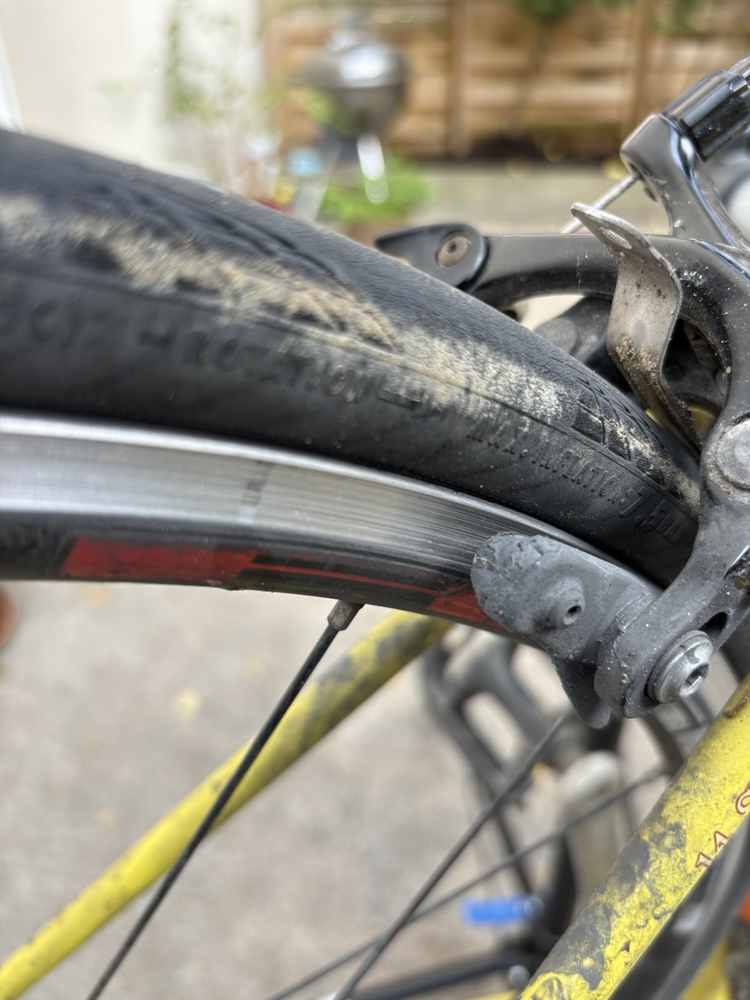
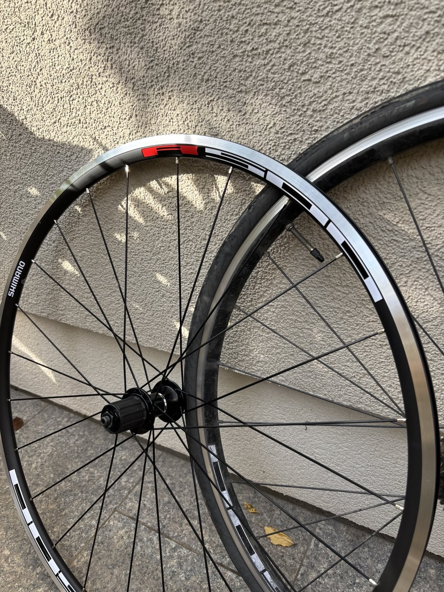

::: {.callout-note}

## Post series

This post belongs to a series about the **Ventoux**:

- [Maintenance 1](../2020-04-27_ventoux-1/index.html) on the 2020-04-27
- [Maintenance 2](../2020-07-14_ventoux-2/index.html) on the 2020-07-14
- [Maintenance 3](../2023-04-29_ventoux-3/index.html) on the 2023-04-29
- [Maintenance 4](../2023-09-17_ventoux-4/index.html) on the 2023-09-17
- [Maintenance 5](index.html) this post

:::

## Wheels

Four years and a half passed and I was monitoring the rim state of wheels. 
Especially the rear one. 
The brake pads are getting worn out at an alarming speed in bad conditions. Such as 
Fall with rain, pieces of dead leaves and other debris. Brake pads are cheap and okay-ish to 
change quickly. But the counterpart is that the rim is also getting worn out fast.

{height=300 fig-align="center"}

The warning sign is telling that a little pin hole must remain visible.
See below the new versus current rim state:

{height=300 fig-align="center"}

I bought exactly the same set of Shimano wheels: R501 219,98 euros.

Was 103 euros in April 2020. Here it is from a local shop but still inflation is quite interesting to witness.

## Rust

Another concern, due to the age of this bike, is the rust. Painting is gone in many places and steel is rusting.
It affects the look, of which I don't care but some critical connections are concerning like this one:

{height=300 fig-align="center"}

Lot of tension due to my weight plus the rear brake forces, so I went to see the local bike shop who advice me 
to scratch this damaged yellow paint and put some anti-rust treatment. I bough this:

{height=300 fig-align="center"}

After scratching and applying the product, it takes time to dry:

{height=300 fig-align="center"}

While it dries, I changed the rear wheel, keeping the same tube, tyre and cassette.

{height=300 fig-align="center"}

The freewheel comes with the Shimano set, the more difficult was to fit again the Continental GP5000 that 
I poorly bought tube less version. Very stiff but I managed.

Once dried, I changed the brake pads and here the final result:

{height=300 fig-align="center"}

## Mirror

I have some mirrors on other bikes, and for commuting my daily distance it is not really 
needed. But, I am giving this a try. After one week, I like it.

{height=300 fig-align="center"}

Because the weight on one side of the handle bar is also a bit annoying, so let's see with more experience how it feels.
