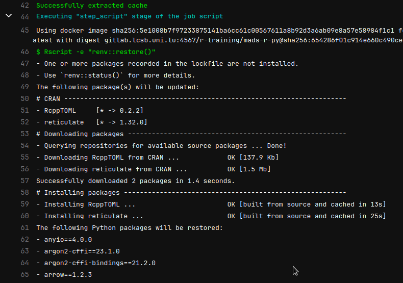
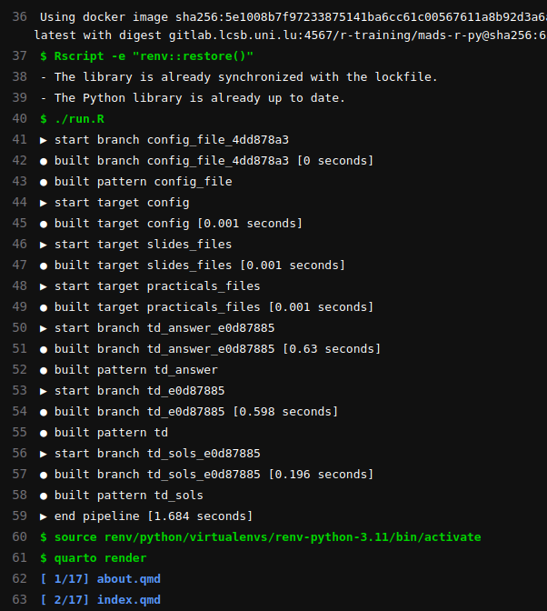

## Aim

Synchronize both  **and**  packages between 
users and   runners that actually render a teaching website using [**Quarto**](https://quarto.org/).

## Introduction

[`{renv}`](https://rstudio.github.io/renv/articles/renv.html) is a package for managing 
 packages at the **project** scale.


###  Python packages

This [article](https://rstudio.github.io/renv/articles/python.html) is succinct but describes that 
`{renv}` can manage Python packages.


## Setup

### Initialization

Following instructions from the `renv` website.
Using the _virtual environment_ solution and not `conda` as the first one is
 included in python3.

You need to have  installed:

- Python: `python3.11-venv`
- R:
    + `{reticulate}`
    + `{renv}`

``` r
> renv::use_python()
Please select a version of Python to use with this project: 

1: /usr/bin/python3

Selection: 1
- Selected "/usr/bin/python3" [Python 3.11.12].
- Creating virtual environment 'renv-python-3.11' ... Done!
- Updating Python packages ... Done!
- Lockfile written to "renv.lock".
- Activated Python 3.11.12 [virtualenv; ./renv/python/virtualenvs/renv-python-3.11]
```

### Installing Python packages

For example, installing `pandas`

``` r
> reticulate::py_install("pandas")
Using virtual environment '/xxxx/xxxx/renv/python/virtualenvs/renv-python-3.11' ...
+ /xxxx/xxxx/renv/python/virtualenvs/renv-python-3.10/bin/python -m pip install --upgrade --no-user pandas
Collecting pandas
  Obtaining dependency information for pandas from https://files.pythonhosted.org/packages/fb/4f/4a4372b2e24439f559b73318683486831d75e59544ae02bf8dec8dd6f48b/pandas-2.1.0-cp310-cp310-manylinux_2_17_x86_64.manylinux2014_x86_64.whl.metadata
  Downloading pandas-2.1.0-cp310-cp310-manylinux_2_17_x86_64.manylinux2014_x86_64.whl.metadata (18 kB)
Collecting numpy>=1.22.4 (from pandas)
  Obtaining dependency information for numpy>=1.22.4 from https://files.pythonhosted.org/packages/9b/5a/f265a1ba3641d16b5480a217a6aed08cceef09cd173b568cd5351053472a/numpy-1.26.0-cp310-cp310-manylinux_2_17_x86_64.manylinux2014_x86_64.whl.metadata
  Downloading numpy-1.26.0-cp310-cp310-manylinux_2_17_x86_64.manylinux2014_x86_64.whl.metadata (58 kB)
     ━━━━━━━━━━━━━━━━━━━━━━━━━━━━━━━━━━━━━━━━ 58.5/58.5 kB 4.0 MB/s eta 0:00:00
Collecting python-dateutil>=2.8.2 (from pandas)
  Downloading python_dateutil-2.8.2-py2.py3-none-any.whl (247 kB)
     ━━━━━━━━━━━━━━━━━━━━━━━━━━━━━━━━━━━━━━━━ 247.7/247.7 kB 10.5 MB/s eta 0:00:00
Collecting pytz>=2020.1 (from pandas)
  Obtaining dependency information for pytz>=2020.1 from https://files.pythonhosted.org/packages/32/4d/aaf7eff5deb402fd9a24a1449a8119f00d74ae9c2efa79f8ef9994261fc2/pytz-2023.3.post1-py2.py3-none-any.whl.metadata
  Downloading pytz-2023.3.post1-py2.py3-none-any.whl.metadata (22 kB)
Collecting tzdata>=2022.1 (from pandas)
  Downloading tzdata-2023.3-py2.py3-none-any.whl (341 kB)
     ━━━━━━━━━━━━━━━━━━━━━━━━━━━━━━━━━━━━━━━━ 341.8/341.8 kB 10.6 MB/s eta 0:00:00
Collecting six>=1.5 (from python-dateutil>=2.8.2->pandas)
  Downloading six-1.16.0-py2.py3-none-any.whl (11 kB)
Downloading pandas-2.1.0-cp310-cp310-manylinux_2_17_x86_64.manylinux2014_x86_64.whl (12.7 MB)
   ━━━━━━━━━━━━━━━━━━━━━━━━━━━━━━━━━━━━━━━━ 12.7/12.7 MB 11.0 MB/s eta 0:00:00
Downloading numpy-1.26.0-cp310-cp310-manylinux_2_17_x86_64.manylinux2014_x86_64.whl (18.2 MB)
   ━━━━━━━━━━━━━━━━━━━━━━━━━━━━━━━━━━━━━━━━ 18.2/18.2 MB 10.9 MB/s eta 0:00:00
Downloading pytz-2023.3.post1-py2.py3-none-any.whl (502 kB)
   ━━━━━━━━━━━━━━━━━━━━━━━━━━━━━━━━━━━━━━━━ 502.5/502.5 kB 10.5 MB/s eta 0:00:00
Installing collected packages: pytz, tzdata, six, numpy, python-dateutil, pandas
Successfully installed numpy-1.26.0 pandas-2.1.0 python-dateutil-2.8.2 pytz-2023.3.post1 six-1.16.0 tzdata-2023.3
``` 

### Snapshot

Now, register with `{renv}` what we have just installed.

The main function `renv::snapshot()` will regiter **both**  and  packages.

``` r
> renv::snapshot()
The following package(s) will be updated in the lockfile:

# CRAN -----------------------------------------------------------------------
- renv   [* -> 1.0.2]

Do you want to proceed? [Y/n]: 
- Lockfile written to "/xxxx/xxxx/renv.lock".
The following will be written to requirements.txt:
- numpy==1.26.0
- pandas==2.1.0
- python-dateutil==2.8.2
- pytz==2023.3.post1
- six==1.16.0
- tzdata==2023.3

Do you want to proceed? [Y/n]: 
- Wrote Python packages to "/xxxx/xxxx/requirements.txt".
```

Checking on the written files, `requirements.txt` is a rather simple text file:

```{.bash filename="requirements.txt"}
numpy==1.26.0
pandas==2.1.0
python-dateutil==2.8.2
pytz==2023.3.post1
six==1.16.0
tzdata==2023.3
```


`renv.lock`, the  relevant part:

```{.bash filename="renv.lock"}
[...]
  "Python": {
    "Version": "3.11.12",
    "Type": "virtualenv",
    "Name": "./renv/python/virtualenvs/renv-python-3.11"
  },
[...]
```

### Quick test


``` r
> pd <- reticulate::import("pandas")
> pd$Series(list(1, 3, 6, 8))
0 1 2 3 
1 3 6 8
```


### `.Rprofile`

In theory, the sourced `.Rprofile` should only contains one necessary line generated by `renv`:

``` bash
source("renv/activate.R")
```

However, if you encountered issue with  not finding the  environment, it could be useful to have those env variables defined:

``` r
Sys.setenv(RETICULATE_MINICONDA_PATH = "renv/python/virtualenvs/renv-python-3.11/")
reticulate::use_python("renv/python/virtualenvs/renv-python-3.11/bin/python")
```


## CI config

Now the Continuous Integration (CI) triggered by every commit needs to:

1. Install the missing packages, especially the  ones
2. Cache them to avoid re-installing at each commit
3. Run the pipeline of building the R code (using `{targets}` (see [previous post](/posts/targets-demos))
4. Render the website using **quarto**

### Caching

The config is:

``` yaml
  cache:
    key: $CI_JOB_NAME
    paths:
      - _targets/
      - _site/
      - lectures_rendered/
      - renv/python/virtualenvs/
      - ${RENV_PATHS_CACHE}
      - ${RENV_PATHS_LIBRARY}
```

- `_targets/` folder that contains the metadata and objects done by `{targets}`, necessary otherwise everything is redone each time.
- `_site` output folder of the website, default name by **quarto**.
- `renv/python/virtualenvs/` cache the python install + packages

Rest is classic and is described [here](https://rstudio.github.io/renv/articles/ci.html#gitlab-ci)

### Building


``` yaml
  before_script:
    - Rscript -e "renv::restore()"
  script:
    - ./run.R
    - source renv/python/virtualenvs/renv-python-3.11/bin/activate
    - quarto render
  tags:
    - shared-cache
  when: always
```

- `./run.R` runs `targets::tar_make()`
- The **key part** is this `source [venv]` line 5. It allows the next line with the `quarto` call to be aware of where is the  install / packages ^[The `.Rprofile` works only for the   part and here we have pure  code in a Quarto document].
- `quarto render` then build the website

### Results

In this screenshot, you see the first time the CI sees the need to install packages for both languages

{fig-align="left"}

And now, after a successful caching, no install is required:

{fig-align="left"}

- line 40-59 is the `{targets}` pipeline
- line 61-63 the beginning of the **quarto** rendering process that involved  **Python**  code.
