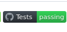
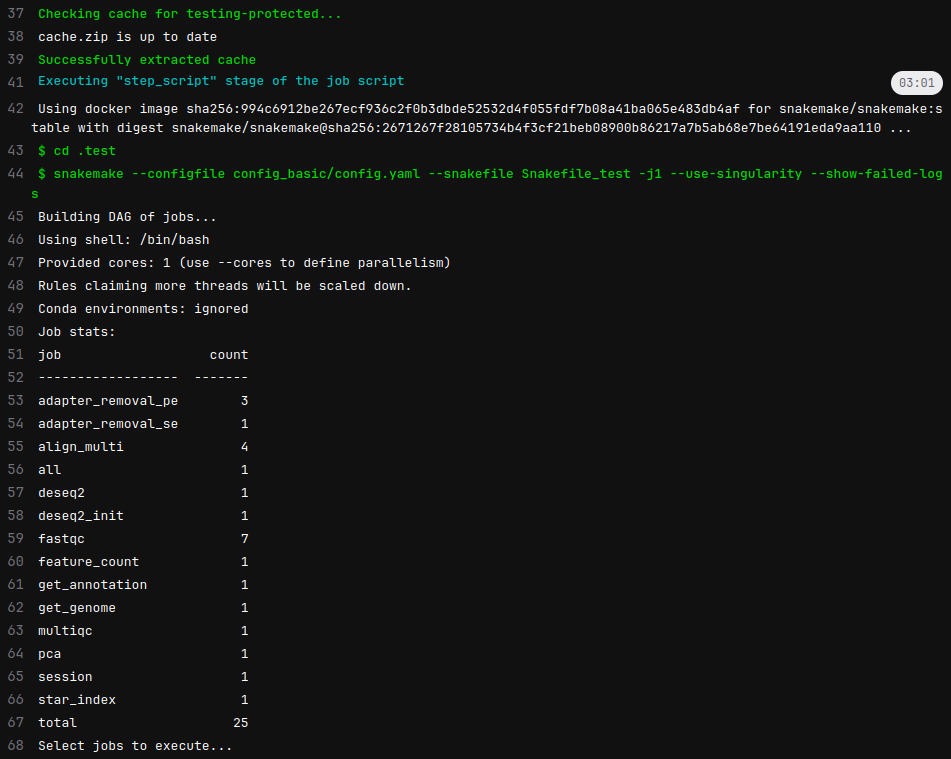
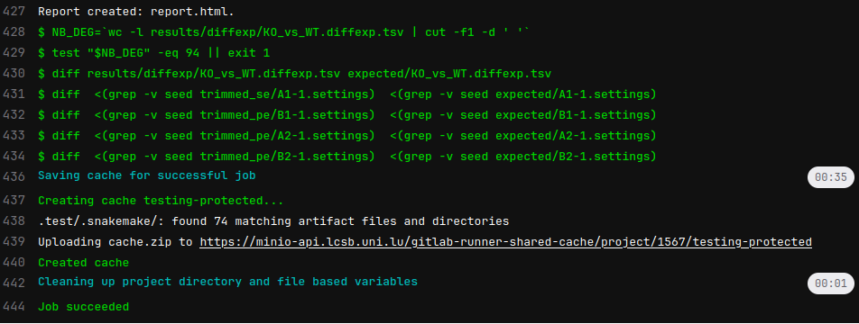

## Rationale

Testing software is necessary and I always do it too late.
Looking [William Landau](https://github.com/wlandau) coding (through watching his `{targets}` repo) 
it is clear that the best way to develop is to write _as the same time_:

- code
- unit tests
- documentation

When struggling on the first item, it appears difficult to concomitantly write the corresponding tests.
Not to mention that documentation could be not even considered in the first place.

This works somehow but suddenly, one repo could gain attention and documentation becomes an 
extended README. Then later, a fresh release is proven to break things, and that's bad when this 
is reported by users and not detected by the author.

Long story short, I wanted my [snakemake template](https://gitlab.lcsb.uni.lu/aurelien.ginolhac/snakemake-rna-seq) for bulk RNA-seq to be tested,
at least a short pipeline on fake data to catch obvious mistakes.

By the way, [Snakemake]() is a Python framework for managing bioinformatic workflow. That 
would deserve a post on itself.

## Inspiration from the experienced people

The template is derived from [this one](https://github.com/snakemake-workflows/rna-seq-star-deseq2) and they implemented testing. Apart from the great looking green badge, it is what I am after: run the pipeline on small data of the Yeast genome.

::: {.column-margin}

:::


Looking at how it is done in their  [GitHub Action file](https://github.com/snakemake-workflows/rna-seq-star-deseq2/blob/master/.github/workflows/main.yml), the relevant part is:

:::{.column-page}
``` yaml
    - name: Test workflow (basic model, no batch_effects)
      uses: snakemake/snakemake-github-action@v1.22.0
      with:
        directory: .test
        snakefile: workflow/Snakefile
        args: "--configfile .test/config_basic/config.yaml --use-conda --show-failed-logs --cores 2 --conda-cleanup-pkgs cache"
```
:::

They are doing more testing but wit the same structure. The annoying part to me is the:

``` yaml
uses: snakemake/snakemake-github-action@v1.22.0
```

Because it abstracts the real pipeline, it works but it has some magic inside and even going through 
the [repo](https://github.com/snakemake/snakemake-github-action) is not giving details.

The same happens for  with `{renv}` cache / restore, `quarto render` and publishing on GitHub pages like for this [very blog](https://github.com/ginolhac/ginolhac.github.com/blob/main/.github/workflows/quarto-publish.yml).

But, some great things are useful, like the option `--show-failed-logs` that I didn't know and that is especially relevant here.

Anyway, the Snakemake template is on  GitLab , so the CI/CD has to happen there.


##  CI/CD configuration

As said, on GiLab, the Continuous Integration/Development has no magic recipes like on . One needs to declare every step.


The content of the config `.gitlab-ci.yml` is:

``` yaml
services:
    - name: docker:dind

variables:
  DOCKER_DRIVER: overlay2
  DOCKER_TLS_CERTDIR: ""

stages:
  - test

testing:
  stage: test
  image: snakemake/snakemake:stable
  cache:
    key: ${CI_JOB_NAME}
    paths:
      - .test/.snakemake/
  script:
    - cd .test
    - snakemake --configfile config_basic/config.yaml 
      --snakefile Snakefile_test -j1 --use-singularity --show-failed-logs
    - snakemake --configfile config_basic/config.yaml 
      --snakefile Snakefile_test -j1 --report
    - NB_DEG=`wc -l results/diffexp/KO_vs_WT.diffexp.tsv | cut -f1 -d ' '`
    - test "$NB_DEG" -eq 94 || exit 1
    - diff results/diffexp/KO_vs_WT.diffexp.tsv expected/KO_vs_WT.diffexp.tsv
    - diff  <(grep -v seed trimmed_se/A1-1.settings)  <(grep -v seed expected/A1-1.settings)
    - diff  <(grep -v seed trimmed_pe/B1-1.settings)  <(grep -v seed expected/B1-1.settings)
    - diff  <(grep -v seed trimmed_pe/A2-1.settings)  <(grep -v seed expected/A2-1.settings)
    - diff  <(grep -v seed trimmed_pe/B2-1.settings)  <(grep -v seed expected/B2-1.settings)

  tags:
    - shared-cache
  when: always
```

I abstracted the specificity of our  Gitlab, suppressing this line:

``` yaml
      command: ["--registry-mirror", "https://docker-registry.lcsb.uni.lu"]
```

Let's break it down

#### Docker in Docker (dind) service

Lines 1 to 6. Nothing special, copied from our template

#### Stages

Lines 8-9. Here only one, but could have a second one for testing the complex design like on 

#### Main part

- `image` copied over from the Github Action, useful that have a  image done.
- `cache` (lines 14-17). I am not using `conda` but [`singularity`](https://docs.sylabs.io/guides/3.1/user-guide/index.html), the  Docker for HPC. Thus it is useful to cache the image to avoid downloading it every single time. Snakemake caches it in `.snakemake/singularity/hashsum.sif` checking if a new one if available.
Lines 32-33 indicates that the cache is shared, so any  runner is able to access the cached data.
- `script` comes in 2 steps:
    + Running snakemake: lines 20-23
    + Testing the results obtained: lines 24-30
    Testing the number of lines of the differential expression TSV, redundant with the exact expected file with a `diff`.
    And testing also the expected trimming stats. Random seed are different so need to be excluded.
- `when` indicates for which action the CI is triggered. Could be only on pull request, release, manual etc. Here we triggered it for any commit push to the repo.

## Demo

A testing run lasts for roughly **4 minutes** which is reasonable. 






Without the cache, the download of the singularity brings the time to 6 minutes 26 seconds.
See the additional pulling notification (line 4):

``` bash
[...]
$ snakemake --configfile config_basic/config.yaml --snakefile Snakefile_test -j1 --use-singularity --show-failed-logs
Building DAG of jobs...
Pulling singularity image docker://ginolhac/snake-rna-seq:0.7.
[...]
```


##  Gitlab repository

This repo is public and available [here](https://gitlab.lcsb.uni.lu/aurelien.ginolhac/snakemake-rna-seq)
